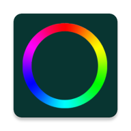

# MyRgb - Controller for RGB-LED strips

MyRgb is an android app and allows you to send HTTP-Requests to your RGB-LED controller to control your LED strips from your smartphone.

# Screenshots

# Features

## LED Controller

- set the color and brightness of your LED strips
- turn certain LED strips on or off
- show your current LED settings (e.g. current color)

## Rgb Alarm

- create alarms to turn on your LED strips at a specific time
- there are two types of alarms:
  - one time alarms are triggered the next time the specified alarm time is reached and then are deactivated
  - recurring alarms are triggered on certain days of the week at a specific time

## Rgb Show

- start rgb show (e.g. switch between different colors with transition)
- set speed of rgb show

# Add your rgb controller

- you can easily add a new controller with its local IP address and a meaningful name
- in my case I am using an esp32 microcontroller that executes the commands sent by the app via HTTP requests to control the connected LED strips

# Protocol for commands

Commands are send via HTTP POST requests and have the following structure:

## ccc.abc.def.

- ccc = command identifier (which type of command) or value for red

## 0 <= ccc <= 255 -> change color

- ccc --> red value (0-255)
- abc --> green value (0-255)
- def --> blue value (0-255)

## 300.abc.xxx. - off command

- turn off certain LED strip
- abc --> id of strip

## 400.abc.xxx. - on command

- turn on certain LED strip
- abc --> id of strip

## 500.abc.xxx. - brightness command

- abc --> brightness value (0-255)

## 600.abc.xxx. - rgb show command

- abc --> speed (0-10)

## 700.xxx.xxx. - current settings command

- receive all current settings (e.g. color values, brightness, strips, which strip is enabled, status of rgb show)

## 800.xxx.xxx. - rgb alarm command

- trigger new rgb alarm

# Technologies

This is an Android Studio project. The UI is implemented with XML files and the following libraries are used among others:

- Room Database for storing rgb alarms
- Proto DataStore for storing ip addresses and names of rgb controller
- Retrofit with moshi converter to send HTTP requests and receive HTTP Responses
- Dagger for dependency injection
- Espresso for UI testing
